<div align="center">

# River Eye

**Real-time water level monitoring for flood-prone canals in Surabaya.**

An OpenCV-based system that reads water levels from a graduated pole using a live IP camera feed, then pushes the readings to a backend API so downstream apps can generate flood alerts and suggest safe routes.

Currently deployed at **Rumah Pintu Air Kalibokor, Keputih, Surabaya**.


</div>

---

## What it does

An IP camera points at a graduated water-level pole inside a flood canal. Every 2 seconds, this program:

1. Grabs the latest frame from the camera stream.
2. Runs a 7-stage vision pipeline to detect where the water surface meets the pole.
3. Converts the detected pixel row into centimeters using a 3-point calibration.
4. Sends the result to a backend server via HTTP POST.

The server drives a live dashboard and feeds a mobile app that suggests flood-free routes to residents.

---

## Quick start

```bash
git clone https://github.com/Aapohaja/RIVER-EYE-OPENCV.git
cd RIVER-EYE-OPENCV
pip install -r requirements.txt
python main.py
```

You will need:

- Python 3.9+
- A reachable IP camera exposing an MJPEG stream (Raspberry Pi or Windows PC works fine)
- A backend endpoint that accepts `POST /logs` with JSON payload
- Calibration values for your specific pole (see `config.py`)

---

## Pipeline

Every frame that passes the freshness check runs through 7 stages before turning into a water level reading.

```mermaid
flowchart LR
    A([IP Camera<br/>MJPEG Stream]) --> B[1 · ThreadedCapture]
    B --> C[2 · Preprocessing]
    C --> D[3 · Crop ROI]
    D --> E[4 · Board Mask]
    E --> F[5 · Column Scan]
    F --> G[6 · Laplacian Refinement]
    G --> H[7 · Kalman Filter 1D]
    H --> I{Confidence<br/>&gt; 0.20?}
    I -- Yes --> J[Convert to cm<br/>3-point calibration]
    I -- No --> K[/Frame skipped/]
    J --> L[HTTP POST JSON<br/>every 2s]
    L --> M([Backend Server<br/>API /logs])

    style A fill:#1e293b,stroke:#38bdf8,color:#f1f5f9
    style M fill:#1e293b,stroke:#38bdf8,color:#f1f5f9
    style I fill:#7c2d12,stroke:#fb923c,color:#fff
    style J fill:#14532d,stroke:#4ade80,color:#fff
    style K fill:#450a0a,stroke:#f87171,color:#fff
    style L fill:#164e63,stroke:#22d3ee,color:#fff
```



### Stage-by-stage

**1 · ThreadedCapture**
A background thread holds the latest frame at all times. The pipeline never blocks on I/O.

**2 · Preprocessing**
Rotate the frame and warp it with homography so the graduated pole stands vertical in the image.

**3 · Crop ROI**
Cut out the polygonal region that contains only the pole. Everything else is discarded.

**4 · Board Mask**
Convert BGR to HSV. Keep pixels where V is bright and S is under 100 — the white pole. Clean up with morphological CLOSE then OPEN.

**5 · Column Scan**
Split the ROI into 80 vertical columns. In each column, scan brk → bright transition. Take the median row across all 80columns as the initial water line.

**6 · Laplacian Refinement**
Within ±20 px of the initial line, pick the row with the highest Laplacian response. This is the sharpest visible edge, which is almost always the true water surface.

**7 · Kalman Filter 1D**
Smooth the estimate across consecutive frames so ripples and momentary occlusions don't cause the reading to jump.

### Confidence gate

If the final confidence is above 0.20, the pixel row is converar interpolation between three calibration marks at 50, 100,and 250 cm. The result is posted to the backend as:

```json
{
  "location_id": "kalibokor-01",
  "water_level_cm": 114.8
}
```

Frames that don't clear the gate are dropped silently. Better to skip a reading than to publish a wrong one.

### Why each stage exists

Every stage was added after the naive version failed at least once in the field:

- **Kalman filter** came in after ripples caused readings to jump ±5 cm frame-to-frame.
- **Laplacian refinement** was added when Otsu alone kept lockead of the water surface.
- **Confidence gate** appeared after a spider walked across the camera at 2 AM and gave a reading of 400 cm.
- **ThreadedCapture** replaced blocking `.read()` calls after the Pi started dropping frames during long HTTP timeouts.

The system is deliberately classical rather than a trained neural net. Classical CV on a Raspberry Pi matches the accuracy a deep model would give — without the labeling effort, the retraining cycle, or the extra compute.

---

## Configuration

Key values live in `config.py`:

- `STREAM_URL` — the MJPEG endpoint of your IP camera
- `ROI_POLYGON` — 4 points defining the graduated pole area in the frame
- `CALIBRATION_POINTS` — 3 known `(pixel_row, cm)` pairs used for linear interpolation
- `API_ENDPOINT` — the backend URL that receives water level readings
- `POST_INTERVAL_SEC` — how often to send readings (default 2s)

Run the interactive calibrator once per site setup:

```bash
python calibrate.py
```

It walks you through picking the ROI polygon and marking the 50 / 100 / 250 cm reference marks visually.

---

## Tech stack

- **Python 3.9+** — everything runs here
- **OpenCV** — frame processing, HSV masking, Otsu threshold, Laplacian, morphology
- **NumPy** — column scan and Kalman math
- **requests** — POST readings to the backend
- **Raspberry Pi 4** — deployment target at the site

---

## Deployment

Currently running on a Raspberry Pi 4 mounted at Rumah Pintu Air Kalibokor, Keputih, Surabaya. The Pi is enclosed in a custom 3D-printed weather-resistant case designed in Fusion 360, alongside a wall-mount bracket for the IP camera.

The Pi runs this program as a `systemd` service so it restarts automatically after power loss.

---

## Why this project

Kalibokor sits in one of the flood-prone corridors of Keputih. During heavy rain, residents lose visibility on how fast the canal is rising until the water is already on the street. River Eye gives them a live number and a routing app that says "avoid this road, take that one" instead of leaving them to guess.

The vision side is deliberately classical (Otsu, Laplacian, Kalman) rather than deep learning. A trained YOLO model would need thousands of labeled water-line photos across every lighting condition. Classical CV with careful calibration hit the same accuracy in a fraction of the compute — which matters when the whole system runs on a Raspberry Pi under an outdoor enclosure.

---

## Author

**Aaron Smeraldo Olivier Manik**
Computer Engineering, ITS Surabaya

[GitHub](https://github.com/Aapohaja) · [LinkedIn](https://linkedin.com/in/aaron-manik)
